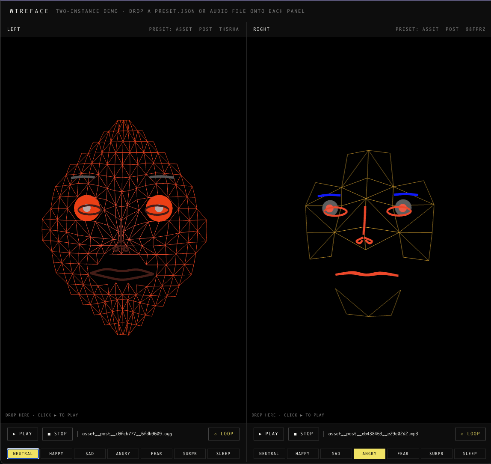

# wireface



**Minimal embeddable wireframe lipsync face renderer** — drives expressive character profiles from voice or TTS audio in the browser.

Each call to `createWireface(canvas)` builds a fully independent instance: its own Babylon engine + scene, its own audio context, its own channel state, its own materials and meshes. Multiple instances live on the same page side-by-side without sharing state — drop a different preset and a different voice clip on each one.

- one source file: [`wireface.js`](wireface.js)
- one runnable demo: [`wireface-demo.html`](wireface-demo.html)
- preset format: plain JSON (drop a `.json` saved by the v010+ UI onto a panel)
- audio: any browser-decodable file (`mp3`, `wav`, `ogg`, `m4a`, `flac`, `aac`, `opus`)

---

## Install

### npm

```bash
npm install wireface
```

### CDN (no build step)

Two flavors are published — pick by file extension:

| Flavor | jsDelivr | unpkg |
|---|---|---|
| **indented** (readable, debuggable) | `https://cdn.jsdelivr.net/npm/wireface@1/wireface.js` | `https://unpkg.com/wireface@1/wireface.js` |
| **minified** (smaller, production) | `https://cdn.jsdelivr.net/npm/wireface@1/dist/wireface.min.js` | `https://unpkg.com/wireface@1/dist/wireface.min.js` |

Pin to a major (`@1`), a minor (`@1.0`), or an exact version (`@1.0.0`) — `latest` works too but isn't recommended for production.

`wireface` has one **peer dependency**: [Babylon.js](https://www.babylonjs.com/) (`babylonjs >= 6.0.0`). Load it from CDN or bundle it yourself before `wireface.js` runs.

---

## Quick start

```html
<!-- Babylon.js as a global, loaded BEFORE wireface.js -->
<script src="https://cdn.babylonjs.com/babylon.js"></script>
<!-- pick one — minified for production, indented for debugging -->
<script src="https://cdn.jsdelivr.net/npm/wireface@1/dist/wireface.min.js"></script>

<canvas id="face" style="width:480px;height:480px"></canvas>

<script>
  const wf = createWireface(document.getElementById('face'));

  // Optional: load a saved preset (see "Preset JSON" below)
  fetch('preset.json').then(r => r.json()).then(p => wf.loadPreset(p));

  // Pull an audio file (or use a File from a drop / file input)
  fetch('voice.mp3').then(r => r.blob()).then(blob => wf.loadAudio(blob));

  // Drive it
  wf.setMood('happy');
  wf.setLoop(true);
  wf.play();
</script>
```

That's the entire surface. Everything else is presets, channels, and moods.

---

## Public API

```ts
createWireface(canvas: HTMLCanvasElement, options?: object) → WireFace

interface WireFace {
  loadAudio(file_or_blob): Promise<void>
  loadPreset(presetObject): void           // the JSON saved by the v010+ UI
  play(fromOffset?: number): void
  pause(): void
  stop(): void
  setMood(name): void                      // 'neutral'|'happy'|'sad'|'angry'|'fear'|'surprise'|'sleep'
  setChannel(name, value): void            // manual override, drag-style (auto-releases after ~1.2s)
  setLoop(bool): void
  setView(view): void                      // 'front'|'three-q'|'profile'|'orbit'
  isPlaying(): boolean
  getDuration(): number                    // seconds (0 if no audio loaded)
  getPosition(): number                    // seconds since playback start
  getActiveMood(): string
  dispose(): void
}
```

Multiple instances are independent — see [`wireface-demo.html`](wireface-demo.html) for a two-panel example with per-panel drag/drop, transport buttons, and mood pills.

---

## Preset JSON

A preset is one plain object — exactly the shape produced by the v010+ UI's **save** button. Two examples ship with this repo:

- [`wireface_asset__post__th5rha.json`](wireface_asset__post__th5rha.json) — dense `21×21` red-wire face, glowy iris, deep eye sockets
- [`wireface_asset__post__ydr7de.json`](wireface_asset__post__ydr7de.json) — sparse `7×9` low-poly blue-wire face, exaggerated mouth scale

### Top-level fields

| Field | Type | Meaning |
|---|---|---|
| `version` | string | preset format version (e.g. `"wireface-v010"`) |
| `createdAt` | ISO string | when the preset was saved |
| `renderConfig` | object | mesh + render + style — see below |
| `channelGains` | object | per-channel gain (`0..N`); scales how much each input drives the face |
| `channelGainSliders` | object | UI-side slider position; `loadPreset` reads `channelGains` |
| `activeMood` | string | one of `neutral`, `happy`, `sad`, `angry`, `fear`, `surprise`, `sleep` |
| `moodTargetWeights` | object | per-mood target weight `0..1` (sum is normally 1) |
| `audioName` | string | hint of the audio that was paired with this preset (informational) |
| `lineColor` / `pupilColor` | hex | top-level color overrides applied after `renderConfig` |
| `id` / `name` | string | UI identifier |

### `renderConfig` fields

| Group | Field | Range | Notes |
|---|---|---|---|
| **mesh** | `meshCols` / `meshRows` | int | grid resolution; rebuild on change. e.g. `21×21` (smooth) or `7×9` (low-poly) |
|  | `mode` | `"wire"` / `"solid"` / etc. | render mode |
|  | `meshVisible` | bool | show the underlying grid |
|  | `minimal` | bool | thin line overlays for mouth/eyes/brows/nose |
|  | `fragment` | bool | break the wire mesh into per-tri fragments |
|  | `flipFace` | bool | mirror the face left↔right |
|  | `lineThickness` | `0.1..2` | overlay tube radius |
| **face shape** | `scaleNose` / `scaleEyes` / `scaleMouth` | `0..2+` | per-feature scaling |
|  | `spread` | `0..1` | how widely shapes spread across the mesh |
|  | `reactivity` | `0..1` | overall morph amplitude in response to audio |
|  | `lipVertAmp` | `0..N` | vertical amplitude of lip motion |
|  | `lipPressForce` | `0..N` | "press" force for closure visemes (`PP`, `MM`-like) |
|  | `jawExtend` / `mouthGrow` | offsets | static mouth shape biases |
| **holes / depth** | `mouthHole` / `eyeHoles` | bool | cut holes in the mesh |
|  | `mouthHoleSize` | `~1..2` | radius multiplier |
|  | `eyeDepth` | int | how deep eye sockets push into the mesh |
|  | `mouthAnchor` / `eyeAnchor` | bool | pin anchor rings to track shape changes |
|  | `overlayTracksMesh` | bool | minimal-line overlays follow mesh deformation |
| **style** | `lineColor` | hex | wire color |
|  | `baseColor` | hex | mesh base color |
|  | `fadeColor` | hex | depth-fade target |
|  | `depthFade` | `0..1` | depth attenuation strength |
|  | `pupilColor` / `irisColor` / `irisSize` | hex / `1..4` | eye styling |
|  | `browColor` | hex | brow line color |
|  | `glow` | bool | bloom-style glow on emissive lines |
|  | `pupils` | bool | render pupils at all |
| **mood** | `moodTransitionTime` | seconds | crossfade time between moods |

### Channels (drives)

Channels are the live signal surface. Audio analysis writes them; `setChannel()` overrides them; `channelGains` scales them; the renderer reads them every frame.

```
viseme_sil viseme_PP viseme_FF viseme_TH viseme_DD viseme_kk
viseme_CH  viseme_SS viseme_nn viseme_RR viseme_aa viseme_E
viseme_I   viseme_O  viseme_U
jawOpen mouthSmile mouthPucker
eyeBlinkLeft eyeBlinkRight eyeLookH eyeLookV eyeSquint
browInnerUp browOuterUp browDown
noseSneer
headRotateX headRotateY headRotateZ
```

Manual overrides via `setChannel(name, value)` lock the channel for ~1.2s, then auto-release back to audio-driven control.

### Moods

Moods are convenience presets that fade across a fixed subset of channels (`browInnerUp`, `browOuterUp`, `browDown`, `mouthSmile`, `eyeSquint`, `noseSneer`, `eyeBlinkLeft`, `eyeBlinkRight`):

| Mood | Effect |
|---|---|
| `neutral` | all-zero |
| `happy` | brows up, smile, slight squint |
| `sad` | inner-brow up, slight brow down, frown, half-blink |
| `angry` | brow down, frown, sneer, squint |
| `fear` | brows up, frown, eyes wide |
| `surprise` | brows up, jaw open |
| `sleep` | eyes closed, brows down |

Crossfade time is controlled by `renderConfig.moodTransitionTime`.

### Views

`setView(view)` snaps the camera; `'orbit'` engages a slow auto-orbit.

| View | Camera |
|---|---|
| `front` | dead-on |
| `three-q` | three-quarter |
| `profile` | side |
| `orbit` | slow continuous orbit |

---

## Demo

The repo ships with [`wireface-demo.html`](wireface-demo.html) — a two-instance side-by-side panel. Each panel:

- accepts **drag-drop** of either a preset `.json` or an audio file
- has its own **▶ play / ❚❚ pause / ■ stop / ⟲ loop** transport
- has a row of **mood pills** (`neutral`, `happy`, `sad`, `angry`, `fear`, `surprise`, `sleep`)
- exposes the live instance on `window.wirefaceLeft` / `window.wirefaceRight` for console poking

To run it locally:

```bash
npx --yes serve -l 5173 .
# or:
npm run demo
```

Then drop the bundled presets onto each panel:

```
wireface_asset__post__th5rha.json   →   left
wireface_asset__post__ydr7de.json   →   right
```

…and drop any `.mp3` of speech on top of either panel.

---

## How it sounds → how it moves

1. `loadAudio()` decodes via `AudioContext` and wires through an `AnalyserNode`.
2. Each frame, the renderer reads frequency-band energies and translates them into viseme channel targets (`viseme_aa`, `viseme_O`, …) plus jaw open / lip press / smile.
3. Active mood blends in across mood-channels with `moodTransitionTime` crossfade.
4. Idle micro-motion adds breathing, blinks, and head sway when no audio is playing.
5. Per-channel smoothing prevents the face from snapping (visemes get heavier smoothing, brows lighter — see `SMOOTH` table in [`wireface.js`](wireface.js)).
6. Final channel state drives mesh morphs + minimal overlay line meshes (mouth lips, eyelids, brows, nose).

---

## Build & publish

The npm tarball ships both flavors:

```
wireface.js              — original, indented source (also at the package root)
dist/wireface.js         — copy of the indented source under dist/ for CDN parity
dist/wireface.min.js     — terser-minified, comments stripped
```

Local build:

```bash
npm install
npm run build
```

CI publishes on tag push — see [`.github/workflows/publish.yml`](.github/workflows/publish.yml).

```bash
# bump → commit → tag → push tag → CI publishes to npm with provenance
npm version 1.0.1
git push --follow-tags
```

The workflow expects an **`NPM_TOKEN`** repo secret (an npm "Automation" token, not "Publish"). Set it once with:

```bash
gh secret set NPM_TOKEN -R styk-tv/wireface
```

---

## License

MIT © 2026 Peter Styk — see [`LICENSE`](LICENSE).
